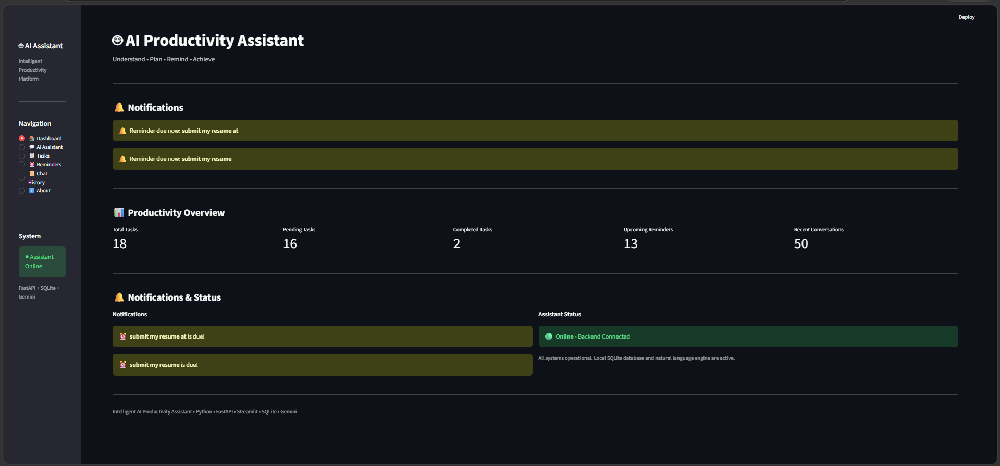
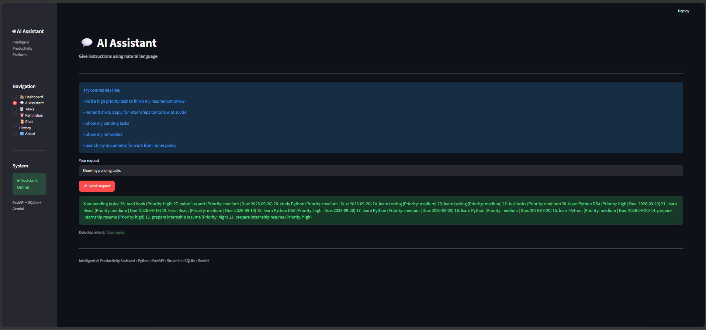
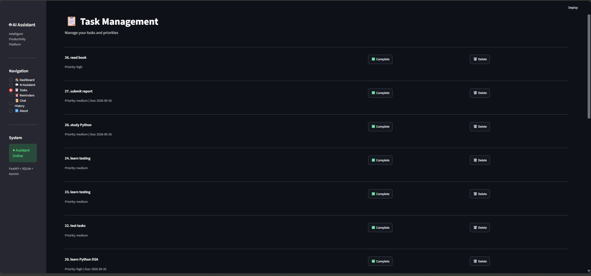
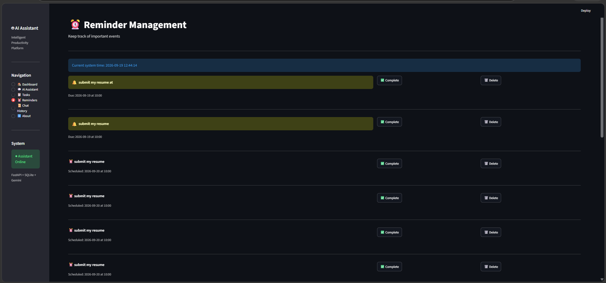
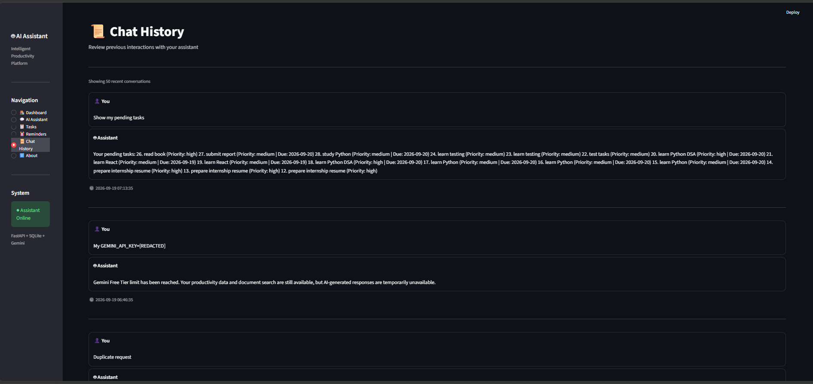

# 1. Intelligent AI Productivity Assistant

## 2. Project Overview
The **Intelligent AI Productivity Assistant** is a powerful, locally-hosted productivity tool combining the efficiency of a fast SQLite database with the intelligence of natural language processing and the Google Gemini API. It allows users to seamlessly manage tasks, set reminders, and query company documents simply by having a natural conversation with the AI.

## 3. Problem Statement
Modern productivity tools often require rigid, form-based data entry (e.g., clicking dropdowns for dates and priorities). Furthermore, many AI-powered tools rely entirely on paid cloud APIs, which can become expensive, hang during rate limits, or expose all personal data to third parties. This project solves these issues by processing standard commands offline locally while using AI strictly for complex summarization.

## 4. Key Features
- **Natural Language Task Management**: Create, complete, and delete tasks conversationally.
- **Smart Reminders**: Schedule one-off or recurring reminders using natural language (e.g., "10 AM", "14:30", "tomorrow").
- **Offline Document Search**: Query local knowledge bases (like company policies) instantly.
- **Offline Intent Engine**: 90% of requests are processed entirely locally and offline, ensuring zero latency and 100% privacy.
- **Gemini Fallback**: Leverages Google Gemini for general knowledge and complex chat, but handles Free Tier rate limits gracefully.
- **Secure Chat History**: All conversations are archived, but API keys and secrets are automatically redacted before saving.

## 5. Architecture
The application runs on a dual-server architecture:
```text
User 
→ Streamlit UI 
→ FastAPI 
→ Intent Detection (Offline NLP Engine) 
→ Tool/Action Router 
→ Tasks / Reminders / Documents / Gemini 
→ SQLite Database
```

## 6. Technology Stack
- **Frontend**: Streamlit (Python)
- **Backend API**: FastAPI (Python)
- **Database**: SQLite
- **AI/LLM**: Google Gemini API (`google-genai` SDK)
- **Scheduling**: APScheduler (Background Reminder Daemons)

## 7. Project Structure
```text
.
├── .env                  # Environment Variables (Ignored in Git)
├── app
│   ├── ai
│   │   ├── assistant.py  # Chat router and Gemini fallback
│   │   └── intent.py     # Local NLP Regex intent engine
│   ├── api
│   │   └── routes.py     # FastAPI endpoints
│   ├── config.py         # App configuration
│   ├── database
│   │   └── database.py   # SQLite schema initialization
│   ├── documents
│   │   ├── company_policy.txt
│   │   └── document_manager.py
│   ├── main.py           # FastAPI Application Entrypoint
│   ├── reminders
│   │   ├── reminder_manager.py
│   │   └── scheduler.py  # APScheduler implementation
│   └── tasks
│       └── task_manager.py
├── productivity.db       # Local Database (Ignored in Git)
├── streamlit_app.py      # Streamlit Frontend UI
└── README.md
```

## 8. Installation Steps
1. Clone this repository to your local machine.
2. Navigate to the project directory: `cd intelligent-ai-productivity-assistant`
3. Set up the virtual environment (see below).
4. Install dependencies: `pip install -r requirements.txt` *(ensure `fastapi`, `uvicorn`, `streamlit`, `google-genai`, `apscheduler`, `requests` are installed)*.

## 9. Virtual Environment Setup
It is highly recommended to run this project in a virtual environment.
```bash
python -m venv venv
# On Windows:
venv\Scripts\activate
# On Mac/Linux:
source venv/bin/activate
```

## 10. Environment Variable Setup
Create a file named `.env` in the root directory. Add your Gemini API key (Free Tier is fully supported):
```env
GEMINI_API_KEY=AIzaSyYourSecretKeyHere...
```
*Note: `.env` is included in `.gitignore` and will never be uploaded to GitHub.*

## 11. How to Run FastAPI
The backend must be running to process requests and manage background reminder schedules.
Run the following in your terminal:
```bash
# On Windows, enforce UTF-8 to support terminal emojis:
set PYTHONIOENCODING=utf-8 && python -m uvicorn app.main:app --host 127.0.0.1 --port 8000
```
*(The API will be available at `http://127.0.0.1:8000`)*

## 12. How to Run Streamlit
In a **separate terminal window** (with your virtual environment activated), start the frontend:
```bash
python -m streamlit run streamlit_app.py
```
*(The UI will launch in your browser at `http://localhost:8501`)*

## 13. Example Natural-Language Commands
You can type these exact phrases into the AI Assistant:
- *"Add a task to learn Python tomorrow with high priority"*
- *"I need to study Python tomorrow."*
- *"Show my pending tasks"*
- *"Remind me to submit my resume tomorrow at 10 AM"*
- *"Show my reminders"*
- *"What is the work from home policy?"*

## 14. Gemini Integration
The app integrates with Google Gemini (specifically `gemini-3.6-flash`) for general chat queries that do not match a productivity intent. 
- Gemini is used **only** when AI-generated responses are required.
- Task management, Reminder management, and Document retrieval **work completely without Gemini**.
- The application does not require paid Gemini billing.

## 15. Gemini Free Tier 429 Handling
Google AI Studio's Free Tier has daily quota limits. If you exhaust your quota, the application will intercept the `HTTP 429` rate-limit error using a specialized queue-timeout thread to prevent the UI from hanging. It immediately returns a graceful fallback message, allowing you to continue using all local productivity tools without interruption.

## 16. Offline/Local Features
- **Regex Intent Engine**: Detects tasks and reminders locally using sophisticated regex parsing.
- **SQLite Storage**: All tasks, reminders, and chat logs are safely stored on your local disk.
- **Document Search**: Scans local `.txt` knowledge bases natively.

## 17. Testing
End-to-End testing confirms full functionality of:
- Task CRUD operations.
- Reminder CRUD and APScheduler daemon logic.
- Natural-Language parsing for edge-case grammar ("don't let me forget to...").
- UI Metrics and Dashboard aggregations.
- Chat history deduplication and automatic API key redaction.

## 18. Future Improvements
- **Multi-User Authentication**: Separate dashboards and SQLite tables by user.
- **Push Notifications**: Connect the local APScheduler to a desktop notification library (like `plyer`) or email service.
- **Vector Embeddings**: Upgrade the local document search from substring matching to local vector cosine similarity.
## 🚀 Project Output

### 🖥️ Dashboard

The dashboard provides an overview of:

- Total Tasks
- Pending Tasks
- Completed Tasks
- Upcoming Reminders
- Recent Conversations
- Notifications
- Assistant Status

### 🤖 AI Assistant

The assistant accepts natural-language commands and routes them to the appropriate productivity module.

Example:

> "Add a task to learn Python DSA tomorrow with high priority."

### ✅ Task Management

Supports:

- Creating tasks
- Task priorities
- Due dates
- Viewing pending tasks
- Completing tasks
- Deleting tasks

### ⏰ Reminder Management

Example:

> "Remind me to submit my resume tomorrow at 10 AM."

The system extracts the reminder title, date, and time and stores it in SQLite.

### 📄 Document Search

Example:

> "What is the work from home policy?"

The system searches the company policy document and returns the answer with the source filename and relevance score.

### 🧠 Gemini AI

Gemini is used for AI-generated responses.

The application handles Gemini Free Tier HTTP 429 errors gracefully and continues to provide core productivity and document-search functionality.

### 💬 Chat History

The application stores:

- User messages
- Assistant responses
- Timestamps

API keys are redacted before messages are stored.

### 🔒 Reliability & Security

- HTTP 429 handling
- Request timeout handling
- API-key redaction
- `.env` protection
- SQLite persistence
- Deterministic intent detection
- Offline-capable core features

### 📊 Architecture

```text
User
 ↓
Streamlit UI
 ↓
FastAPI Backend
 ↓
Intent Detection
 ↓
Action Router
 ├── Task Manager
 ├── Reminder Manager
 ├── Document Search
 └── Gemini AI
 ↓
SQLite Database
## 📸 Screenshots

### Dashboard


### AI Assistant


### Task Management


### Reminder Management


### Chat History
