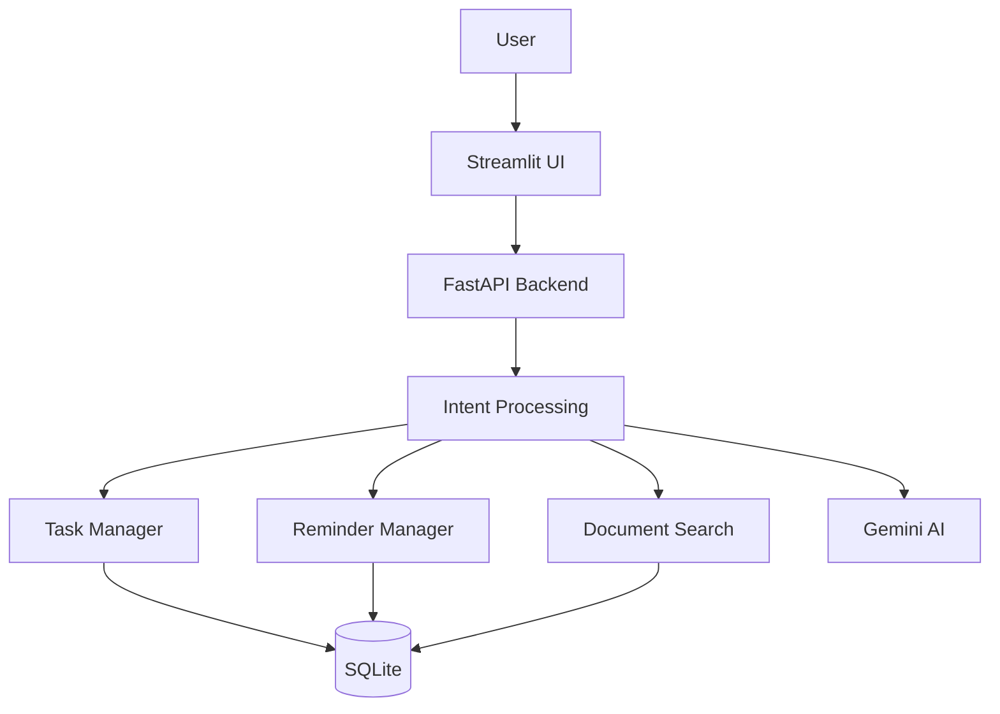

# Intelligent AI Productivity Assistant


The **Intelligent AI Productivity Assistant** is a professional, developer-focused workspace that bridges the gap between natural-language commands and deterministic productivity management. By utilizing FastAPI, Streamlit, and the Gemini API, it provides a seamless interface to handle tasks, reminders, and documents through conversational AI, all while adhering to precise engineering constraints.

## Problem Statement
Modern developers often juggle multiple task managers, calendar apps, and AI chatbots. Switching between these tools disrupts focus. A unified, privacy-conscious platform that parses natural language into concrete data actions (like creating tasks or reminders) is needed to streamline workflows.

## Solution
This application centralizes productivity by allowing users to communicate naturally with an AI assistant. The backend interprets the intent—creating a task, scheduling a reminder, searching local documents, or carrying out a general conversation—and stores actionable items in a local SQLite database, giving users control over their data in a unified dashboard.

## Key Features
* **Natural-Language Command Processing**: Convert conversational inputs into actionable tasks and reminders.
* **Intelligent Document Search**: Query local TXT, PDF, and DOCX files for quick, relevant context using keyword extraction.
* **Deterministic Task & Reminder Management**: Strict SQLite persistence combined with APScheduler for reliable background job execution.
* **Graceful Degradation**: Core features remain entirely functional even if the Google Gemini AI quota is reached or connectivity drops.
* **IST Timezone Native**: Architected with strict `Asia/Kolkata` timezone awareness for reliable operations locally.
* **Dark SaaS Developer UI**: A sophisticated, text-driven UI optimized for developers, removing all distracting emojis and gradients.

## Architecture



## Request Flow
1. User enters a query into the Streamlit AI Assistant.
2. The UI sends a POST request to FastAPI (`/chat`).
3. The Intent engine classifies the request (Task, Reminder, Document Query, or General).
4. If actionable, it uses deterministic logic to interact with SQLite.
5. If general, it securely queries the Gemini API.
6. A consolidated, human-readable response is sent back to the UI.

## Tech Stack
* **Backend:** Python, FastAPI, APScheduler
* **Frontend:** Streamlit, CSS
* **Database:** SQLite
* **Document Processing:** pypdf, python-docx
* **AI:** Google Gemini API (via google-genai)

## Project Structure
```text
intelligent-ai-productivity-assistant/
├── app/
│   ├── ai/          # Intent processing and Gemini integration
│   ├── api/         # FastAPI routes
│   ├── database/    # SQLite configuration and connection
│   ├── documents/   # File parsing and search logic
│   ├── reminders/   # Reminder management and APScheduler background jobs
│   └── tasks/       # Task management logic
├── documents/       # Local directory for user documents (PDF/DOCX/TXT)
├── tests/           # Pytest suite
├── .env.example
├── requirements.txt
├── README.md
└── streamlit_app.py # Main frontend application
```

## Installation
1. Clone the repository.
2. Create a virtual environment: `python -m venv venv`
3. Activate it: `venv\Scripts\activate` (Windows) or `source venv/bin/activate` (Unix)
4. Install dependencies: `pip install -r requirements.txt`

## Environment Configuration
Copy `.env.example` to `.env` and insert your Gemini API Key.
```env
GEMINI_API_KEY=your_api_key_here
```

## Running the Application
To run the full stack, you need two terminal windows:

**Terminal 1 (Backend):**
```bash
python -m uvicorn app.main:app --reload --host 127.0.0.1 --port 8000
```

**Terminal 2 (Frontend):**
```bash
streamlit run streamlit_app.py
```

## API Documentation
Once FastAPI is running, interactive Swagger UI documentation is available at:
`http://127.0.0.1:8000/docs`

## Database
Uses a local SQLite file (`productivity.db`). The schema strictly separates tasks, reminders, and chat history. Deleting or archiving items preserves database integrity through parameterized SQL execution.

## Timezone
All background processing, reminder scheduling, and user-facing dates strictly utilize `Asia/Kolkata` (IST) using Python's native `zoneinfo`. Server and OS local times are explicitly overridden in the logic to guarantee consistent user experiences.

## Error Handling
The application never exposes stack traces to the end-user. Network timeouts, database locks, and Gemini Free Tier API Quota Limits (`HTTP 429`) are caught natively. The UI continues to allow Task, Reminder, and Document management seamlessly. Technical errors are collapsed into an expandable "Technical details" section.

## Security
- API keys are exclusively sourced from environment variables.
- SQLite transactions use parameterized queries to prevent SQL injection.
- `.gitignore` securely tracks environment files, caches, and database states.

## Testing
An isolated test database is spun up automatically when running pytest.
```bash
pytest
```

## Engineering Decisions
* **Decoupled Frontend**: Using Streamlit solely as a presentation layer ensures the FastAPI backend can theoretically be attached to any future frontend (React/Vue/Mobile) without rewriting core logic.
* **Deterministic Parsing over LLM dependency**: Relying on strict python text-parsing (regex/keywords) for setting tasks/reminders reduces API latency, completely prevents LLM hallucinations, and drastically reduces API costs.
* **Stateless UI**: All metrics, empty states, and visual progress bars in Streamlit are generated strictly from mathematical computations of the SQL state, ensuring zero drift.

## Future Improvements
* Add user authentication and JWT middleware for multi-tenant support.
* Integrate OAuth for calendar syncing.
* Introduce semantic vector search via embeddings for documents.

## Developer
Developed as a production-grade portfolio project showcasing full-stack python engineering, modular architecture, resilient error handling, and robust integration of modern GenAI capabilities.