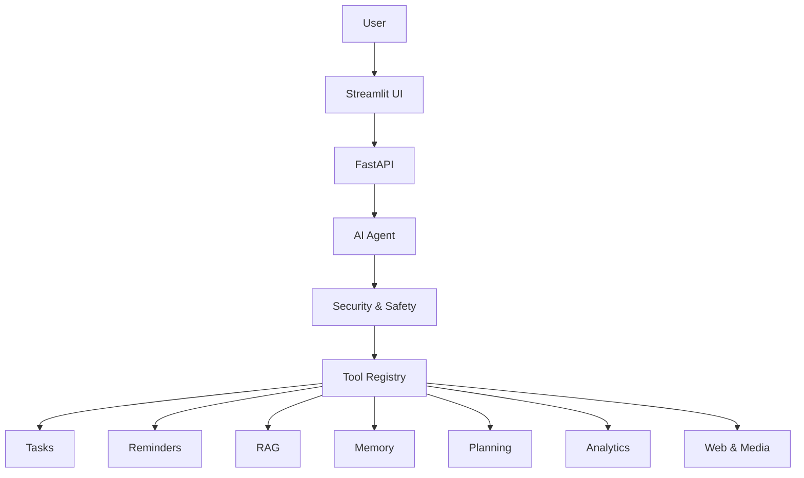

# Intelligent AI Productivity Assistant

An advanced, autonomous, full-stack productivity assistant that operates strictly locally and manages tasks, reminders, documents, goals, and security through natural language planning.

## Overview

The Intelligent AI Productivity Assistant transforms how users manage their daily tasks, goals, and knowledge. Instead of manually interacting with disparate menus, users speak or type their goals. A central AI Agent plans operations, verifies them against a strict Security Policy, and autonomously executes them across SQLite-backed modules.

## Key Features

- **Natural language task management:** Create, list, delete, and complete tasks naturally.
- **Reminder management:** Schedule reminders that track against the `Asia/Kolkata` local timezone.
- **Voice assistant:** End-to-end local speech-to-text integration for vocal requests.
- **AI agent:** An autonomous planner interpreting goals into sequential tool calls.
- **Tool registry:** Highly scalable function-call router powering the entire backend.
- **Advanced RAG:** Ingests local PDFs and DOCX files into a local semantic vector space.
- **Semantic document search:** Chat directly with your files using hybrid retrieval.
- **Persistent memory:** Explicit preference retention enabling true personalization.
- **Autonomous planning:** Goal prioritization, milestone mapping, and dependency-graph creation.
- **Productivity analytics:** Insights and metrics summarizing your execution velocity.
- **Web assistant:** Restricted and safe external resource and media searching.
- **Security and permissions:** Overarching intercept layer checking bulk/destructive actions against explicit Risk mappings.
- **Audit logging:** Persistent recording of all safe (and rejected) executions masked by Regex-based redaction.

## Architecture

## Setup Instructions (Windows)

1. Clone or extract the repository locally.
2. Run `setup.bat` to automatically build the virtual environment and initialize dependencies.
3. Add your `GEMINI_API_KEY` to the generated `.env` file.
4. Open two terminals:
   - **Terminal 1:** Run `venv\Scripts\activate` then `python -m uvicorn app.main:app --reload`
   - **Terminal 2:** Run `venv\Scripts\activate` then `streamlit run streamlit_app.py`
5. Open `http://localhost:8501` to start.

## Fallback Mode

If Gemini is rate limited or unavailable, the assistant falls back into a deterministic local mode to guarantee zero data loss.
